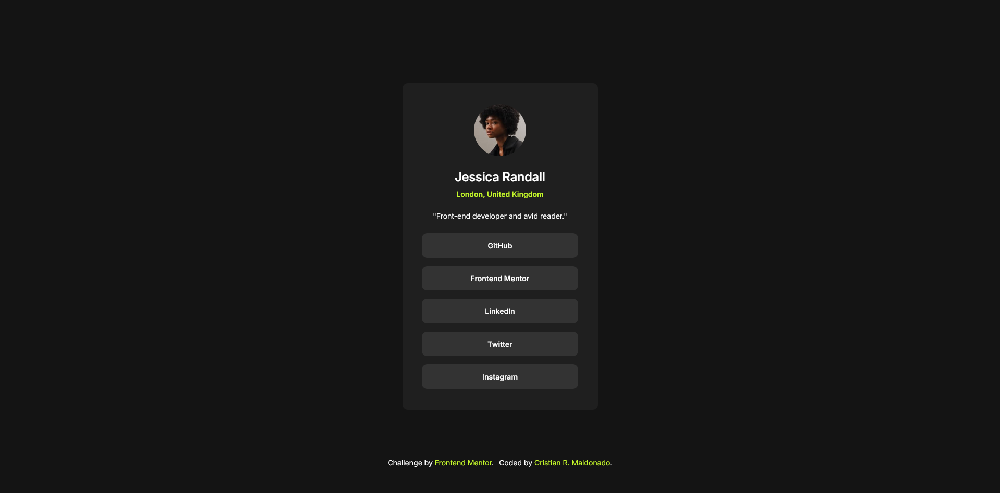

# Frontend Mentor - Social links profile solution

This is a solution to the [Social links profile challenge on Frontend Mentor](https://www.frontendmentor.io/challenges/social-links-profile-UG32l9m6dQ). Frontend Mentor challenges help you improve your coding skills by building realistic projects. 

## Table of contents

- [Overview](#overview)
  - [The challenge](#the-challenge)
  - [Screenshot](#screenshot)
  - [Links](#links)
- [My process](#my-process)
  - [Built with](#built-with)
  - [What I learned](#what-i-learned)
- [Author](#author)

## Overview

### The challenge

Users should be able to:

- See hover and focus states for all interactive elements on the page

### Screenshot

### Links

- [Solution URL here](https://github.com/cristianmdn/social-links-profile)
- [Live site URL here](https://crm-social-links.netlify.app/)

## My process

### Built with

- Semantic HTML5 markup
- Flexbox
- Desktop-first workflow

### What I learned

This was a simple project but I learned about the focus state and the tabindex attribute. I deciced to just make it look as close as possible to the given design. I don't really care too much about adding my personal colors palette and all that. I just want to learn as much as I can and practice what matters the most.

## Author

- Github - [Cristian R. Maldonado](https://github.com/cristianmdn)
- Frontend Mentor - [@cristianmdn](https://www.frontendmentor.io/profile/cristianmdn)
